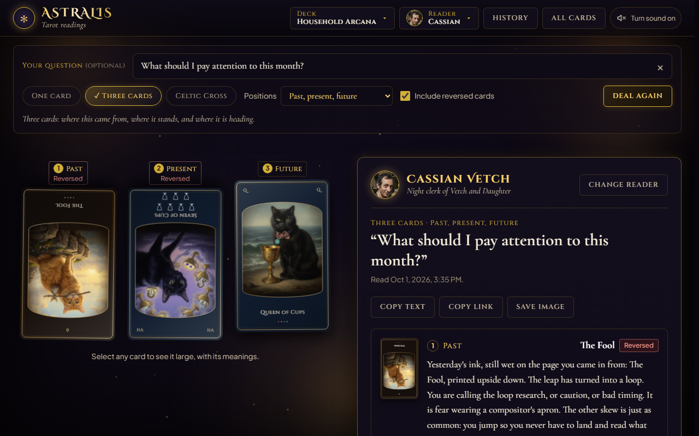

# Astralis

A single-page tarot app in plain HTML, CSS, and JavaScript modules, with no build step and no dependencies.

Draw one card, three cards, or a ten-card Celtic Cross from a 78-card deck. Turn the cards over one at a time and a reader interprets each one in its position. Finished readings are kept in the browser's history, can be shared as a link, copied as text, or saved as a picture.



## Running it

```bash
npm start
```

Then open <http://127.0.0.1:5173>. The server is `server.js`, a small static file server; set `PORT` to use a different port.

```bash
npm test
```

runs the test suite with Node's built-in test runner (`tests/`).

## What is in it

- **Three spreads.** One card, three cards with a choice of positions (past/present/future, situation/obstacle/advice, mind/body/spirit), and the Celtic Cross. Position names, descriptions, and roles live in `js/spreads.js`.
- **Two decks.** Household Arcana (the house cats, photographed and painted, all 78 cards) and Feline Mystica (painted cats on the major arcana, aces and most courts; the other 39 cards use line drawings).
- **Three readers.** Ruth Calloway, a retired trucker; Cassian Vetch, a letterpress night clerk; Lyle Pasternak, a sacked ethics lecturer in a parking lot. Each has its own line for every card, upright and reversed, and its own framing for every position.
- **Custom readers.** The Readers drawer has a code editor with a worked example. Paste a reader object and it is added for the session.
- **Reversals** can be included or not; the setting applies from the next deal.
- **History and links.** A finished reading is saved on the device and in the address bar. Copy link reopens the same cards, in the same positions, with the same reader.
- **Card browser.** All 78 cards, searchable by name or keyword, with upright and reversed meanings.
- Sound effects and an optional background sound are synthesized with the Web Audio API.

## Where things live

```
index.html              The page
css/styles.css          All styling
js/app.js               Application controller: state, dealing, reading panel, dialogs
js/spreads.js           Spread and position copy (names, descriptions, roles)
js/cards.js             GENERATED card data; edit build_cards_data.js instead
js/svg-art.js           GENERATED card art for the Feline Mystica deck; edit src/art and run build_svg_art.js
js/household-deck.js    Household Arcana renderer
js/reader-interface.js  Reader registry and the suit/major tally helper
js/readers/             Built-in readers; *-lines.js files hold the per-card text
js/history.js           Reading records, browser history, link encoding
js/share-image.js       Save a reading as a picture
js/shuffle.js           Fisher-Yates shuffle with optional reversals
js/sound.js             Web Audio sound effects
js/candlelight.js       Background canvas animation
assets/                 Painted and photographed card images
build_cards_data.js     Source of js/cards.js  (node build_cards_data.js)
build_svg_art.js        Source of js/svg-art.js (node build_svg_art.js)
server.js               Static file server for local use
```

`src/` and `readers-panel/` are earlier prototypes. `index.html` does not load them; `tests/legacy-src-cassian.test.js` still exercises `src/`.

## Adding a reader

A reader is an object with an `id`, a `name`, and an `interpret(spreadData)` method. Optional fields shown in the interface are `title` (one line under the name), `bio`, `philosophy` (quoted in the Readers drawer), `avatar`, and `portrait` (an image path).

```js
export const MyReader = {
  id: "my_reader",
  name: "My Reader",
  title: "One line under the name",
  bio: "Shown in the Readers drawer.",

  interpret({ spread, cards, question }) {
    // spread:   { id, name, positions }
    // cards:    [{ card, isReversed, position }], one per position, in order
    // question: what the user typed, possibly empty
    return {
      readerId: this.id,
      readerName: this.name,
      readerTitle: this.title,
      summary: "Shown once every card is turned.",
      elementalInsight: "One sentence on the balance of suits. The app shows the counts itself.",
      cardReadings: cards.map(({ card, isReversed, position }) => ({
        positionIndex: position.index,
        positionName: position.name,
        cardName: card.name,
        isReversed,
        reflection: "What this card means in this position. The only per-card field that is shown."
      })),
      actionableAdvice: "Shown under the heading Advice.",
      closingBenediction: "Shown last, with no heading."
    };
  }
};
```

Key frames on `position.role` rather than on the position name; the roles are listed in `js/spreads.js` and do not change when the copy does. `ReaderRegistry.analyzeElements(cards)` returns the suit and major counts and a `dominant` group, or `null` when nothing leads.

To ship a reader with the app, import it in `js/app.js` and call `registry.register(...)` beside the others. To try one without editing code, open Readers and use Add a custom reader.

## Changing card text

Edit `build_cards_data.js` and run `node build_cards_data.js`. Each card has an `element`, a `ruler` (majors only), an `esotericTitle`, one or two sentences for upright and reversed, and lower-case keywords. The three readers do not quote this text; it is shown in the card dialog and the card browser, and it is the fallback when a reader fails.
